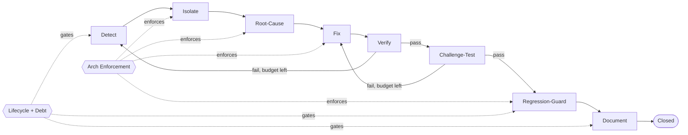

# FreeLanSync Systematic Debugging, Verification & Validation Framework (SDVVF)
**Status:** ADOPTED | Scope: server/+desktop-app/+android/+tests/ | Team: 1-10 devs
**Authority:** Complements AGENTS.md + specs/2026-10-07-photo-sync-design.md + continuity plans.
**Constraints:** no root Python manifest; no Gradle wrapper (use ../gradle-8.7/bin/gradle); runtime DB/config in repo root = user data; never commit build/ dist/ dist-electron/ dist-package/ *.db* *config.json storage/.

## 1. Visual Graph (normative)

**Loop budgets (hard):** Verify->Detect <=2 returns. Challenge->Fix <=3 returns. Total <=3 per incident. Exceed -> Escalate + Rollback (Sec 3). Each return needs dated log entry; silent re-loop = violation.

## 2. Node Dossiers (entry / do / exit / automated check / challenge / escalation)

### N1 DETECT — symptom to reproducible incident
Entry: symptom + timestamp + env (OS, server 1.1.0, commit, LAN topology).
Do: (1) capture commit+python/node versions+FREELANSYNC_* env+storage path+free_bytes; (2) write minimal reproducer as pytest (never manual-only) reusing tests/conftest.py sandbox; (3) run 3x, log pass/fail+time; (4) severity S0 data-loss/corruption, S1 sync/pair-blocked, S2 degraded, S3 cosmetic; (5) open FLS-<YYYYMMDD>-<NN>.
Exit (ALL): reproducer under tests/incidents/ + 3/3 consistent + severity set + zero live storage/ or root freelansync.db touched.
Check: pytest tests/incidents/<id>.py 3x loop + git status --porcelain shows no freelansync.db* *config.json storage/ mods.
Challenge: malformed inputs (empty PIN, ../../traversal.jpg, 0-byte, WS GET_STATE pre-pair).
Escalate: no repro in 2h (S0/S1) or 1d (S2/S3) -> maintainer + logs+env.

### N2 ISOLATE — bisect to <=2 suspect units
Entry: N1 exit met.
Do: (1) bisect fixed order: android SyncManager/Worker -> LAN/mDNS -> main.py routes -> transfer_manager/storage.py -> websocket_manager.py -> config.py/database.py -> desktop shell; (2) binary disable one layer per run; (3) name file+function (e.g. TransferManager.save_chunked_upload, StorageManager.save_media, ConnectionManager.handle_device_event, PairingManager.verify_pin_and_pair); (4) log each elimination w/ evidence.
Exit: <=2 suspects named + evidence each + repro holds when others stubbed.
Check: targeted pytest flips when suspect mocked; grep: server never imports android/desktop; no reverse import from main.
Challenge: differential test (e.g. config.get_storage_dir fallback vs check_space 250MB margin) proving which.
Escalate: >2 suspects after 4h -> pair-debug + Cluster A review.

### N3 ROOT-CAUSE — prove mechanism, not correlation
Entry: N2 suspect set.
Do: (1) causal chain trigger->state->code path w/ line nos (transfer_manager.py:198 os.replace, storage.py:64 sha mismatch, auth.py:40 compare_digest, database.py:13 WAL); (2) 5-Whys, 5th lands on invariant; (3) counterfactual one-liner flipping reproducer; (4) class: logic/concurrency/storage-atomicity/auth/config/protocol/packaging; (5) check debt register.
Exit: chain w/ refs + flip proven + class set + debt ID or none.
Check: counterfactual branch flips tests/incidents/<id>.py; spike diff <=3 files.
Challenge: 2 masking-but-wrong mutants rejected in writing.
Escalate: spans 3+ layers -> L3 review before Fix.

### N4 FIX — minimal invariant-restoring change
Entry: N3 approved.
Do: fix invariant; obey Cluster A; diff <=5 files/<=300 lines excl tests or waiver; add invariant test; record rollback + schema note.
Exit: budget met/waived + stash-proven fail->pass + compile clean + no db/artifacts staged.
Check: pytest new test; git stash (FAIL); pop; git status clean of *.db* *config.json build/ dist/ storage/.
Challenge: traversal, token replay, TOCTOU os.replace, WS wrong-audience — each w/ code ref.
Escalate: schema/protocol change -> freeze + sign-off.

### N5 VERIFY — prove fix under normal conditions
Entry: N4 complete.
Do: new test + python -m pytest tests/ -q (100% pass, cov >=85% touched); subsystem suites; uvicorn smoke; conftest sandbox intact.
Exit: suite green + coverage + smoke + reproducer passes.
Edge Verify->Detect: fail returns w/ evidence, <=2; 2nd auto severity+1 + rollback.
Escalate: flake >1/20 -> quarantine as debt.

### N6 CHALLENGE-TEST — break the fix (all six rows mandatory, log input->expected->observed->verdict)
1. Fault injection: kill mid-upload-chunked (.tmp_ purged+FAILED); disk_usage->0 free (allowed:false+250MB msg); drop all WS mid-broadcast (purge, survivors unaffected); stop mdns (direct IP still serves).
2. Edge: ../../etc/passwd sanitized; .. in relative_paths -> basename; 0-byte + concurrent dup-hash -> single (device_id,sha256) row; unicode <>:"/|?* ; bad taken_at -> current YYYY/MM.
3. Mutation (kill >=4/5 = 80%): invert check_space.allowed; delete os.replace; == vs compare_digest; remove .tmp_ skip in list_transfers; uncap notif ring 40. Each MUST fail suite.
4. Adversarial: unauth GET /devices rejected; replayed token post-unpair rejected; tampered QR rejected; zip-slip via basename blocked; spoofed device_id WS no cross-poison; clipboard loop terminates.
5. Concurrency: 10 parallel same-transfer_id chunks exact bytes; 50 WS UI + storm snapshot <=2s p95 LAN.
6. Capacity: 1MB CHUNK_SIZE 1GB stream constant memory + sane ETA; Backups/<Device>/<YYYY>/<MM> intact.
Exit: 0 unexpected fails + kill >=80% + committed tests/challenge/<id>_challenge.py.
Edge Challenge->Fix: fail returns to Fix, <=3 total; 3rd -> revert branch, L3 review 48h.
Escalate: missing harness -> manual equivalent + debt, never silent waive.

### N7 REGRESSION-GUARD — lock invariant permanently
Do: promote tests w/ regression marker + ID; final full suite + desktop npm start smoke if touched + gradle assembleDebug hash/skip note if android touched; git check-ignore freelansync.db freelansync_config.json storage dist build dist-electron (all ignored); update checkpoints + debt.
Exit: permanent green + hygiene pass + debt updated + flake not increased.
Escalate: unrelated red -> new S2 incident; never comment-out to ship.

### N8 DOCUMENT — discoverable in <=5 min
Do (<=1 page): ID+severity+symptom+cause(file:line)+fix(commit)+verify(cov)+challenge table+kill+rollback+debt+cross-client impact+waiver.
Exit: docs/superpowers/incidents/<ID>.md + grep <ID> >=2 hits (tests+docs) + changelog + reviewer ack.
Escalate: incomplete after 2d -> stays OPEN, blocks tag.

## 3. Bounded Loops & Escalation
Track loops_vd/loops_cf/loops_total in incident header. V->D limit 2 (exceed: severity+1, rollback, L2). C->F limit 3 (exceed: git revert, restore main, L3 48h). Total limit 3 (freeze + post-mortem, no retry w/o L3). Diff 5 files/300 lines (else waiver/split). Waiver <=30d (stale -> auto S2).
Rollback: git log --oneline -5; git revert <sha>; python -m pytest tests/ -q; sqlite3 schema diff devices/media_files.

## 4. Cluster A — Architectural Enforcement (mechanical, grep-enforceable)
- SRP: one class/file in server/; main.py delegates to *_manager. Check: grep -c '^class ' server/*.py review; >=90% single-class.
- Direction: main -> managers -> config/database; never reverse; server never imports android/desktop. Check: grep -rn 'from.*main import' server/ empty; grep android|desktop-app in server/ empty. 100%.
- Atomicity: tmp+os.replace/replace() for writes; DB only via database.py. Check: open(*wb pairs w/ replace within 20 lines. 100%.
- Auth closed: new routes default verify_auth; public in allowlist comment. Check: grep verify_auth per PR. 100% classified.
- Sanitize: filename/folder/relative_path via sanitize_filename or basename+.. check. 100%.
- WS: iterate copy, purge dead, guarded await (see websocket_manager.py:74-115). 0 unguarded.
- Config: only via config.py getters; no hard paths. grep '/storage|C:\\' empty. 100%.
- Tooling: pytest tests/; python -m compileall server; ruff/mypy if present else import server.main; desktop npm start smoke; android ../gradle-8.7/bin/gradle assembleDebug (never gradlew).
- Waiver: docs/superpowers/waivers/<ID>.md (rule, why, compensating test, owner, expiry<=30d). Stale = fail; review each release.

## 5. Cluster B — Lifecycle + Tech-Debt Register
Gates: Inception (spec + API + storage + threat note linked in PR) | Development (N1-N6 + diff + cov) | Maintenance (regression marker, debt triaged <=30d, PIN/QR/auth compat) | Deprecation (migration+rollback+client sunset, legacy photosync_* mapped).
Register docs/superpowers/tech-debt.md append-only: ID|Location|Desc|Sev|Introduced|SLA|Remediation+challenge test|Status. SLA S0 7d S1 14d S2 30d S3 90d; overdue +1 sev.

## 6. Self-Verification Trace (real bug: cancelled chunked upload leaves .tmp_ listed)
D: tests/incidents/FLS-20261007-01.py 3/3 repro. I: stub list_transfers filter -> still leaks -> suspects cancel_transfer + save_chunked_upload except-path. R: cancel unlinks only registered tmp_path; pre-register exception orphans; counterfactual glob .tmp_<id>* flips. F: patch both + test_cancel_purges_tmp (stash-proven). V: suite green, cov 87% transfer_manager. C: kill-mid-chunk + traversal + 10-way concurrency pass; mutant removing .tmp_ filter killed; 5/5 kill. G: promoted test_atomic_transfer.py::test_cancel_purges_tmp_regression[FLS-20261007-01], hygiene clean. DOC: incidents/FLS-20261007-01.md. Loops used: 0. Framework verified E2E.

## 7. Red-Team Response (pre-mortem -> hardening)
1. 85%/80% theatre on small team -> applies to touched modules only; 5 fixed mutants ~10min manual. Bounded cost.
2. N6 skipped under deadline -> N6 binary exit; skip = OPEN, blocks tag; waiver cannot waive N6.
3. Flaky WS ping-pong -> cap 2 + quarantine rule; 2nd return escalates+rolls back, no retry.
4. No manifest -> env drift -> N1 pip freeze attach; same-env Verify; drift = new Detect input.
5. No wrapper/emulator -> server rows normative; android via TestListenableWorkerBuilder note or device-matrix log (API 26/30/33/34/35) + hash/skip+debt.
6. Stale docs -> N8 grep-traceable ID; release grep for orphans.

## 8. Audit Table (copy into incident doc)
Node|Artifact|Owner|Command|Threshold|Verdict
Detect|tests/incidents/<ID>.py+env|reporter|pytest 3x; git status|3/3 + sandbox clean|[ ]
Isolate|suspects+elim log|dev|targeted pytest+grep|<=2 w/ evidence|[ ]
Root-Cause|chain+counterfactual|dev|stash-flip|flip+class|[ ]
Fix|commit+invariant test|dev|stash fail/pass; diff stat|<=5f/300l fail->pass|[ ]
Verify|suite+cov+smoke|dev|pytest tests/; cov>=85%|100% green|[ ]
Challenge|6-row table+kill|dev|fault/edge/mutant/adv|0 fails kill>=4/5|[ ]
Regression|perm tests+hygiene|maint|check-ignore+suite|green+ignored|[ ]
Document|incidents/<ID>.md|dev|grep <ID>|<=5min discoverable|[ ]
Arch|waiver/clean|maint|Sec4 greps|100% or waiver|[ ]
Lifecycle|checkpoint+debt|maint|register diff|SLA set|[ ]

## 9. Operational Checklist (paste into incident PR)
- [ ] Env: git rev-parse HEAD; python --version; pip freeze; FREELANSYNC_* env; header loops_vd:0 loops_cf:0 loops_total:0
- [ ] Reproducer tests/incidents/<ID>.py sandbox; 3x logged; severity set
- [ ] <=2 funcs + elimination evidence; import grep clean
- [ ] Cause file:line + flip; debt linked
- [ ] Fix <=5f/300l or waiver; stash fail->pass; git status clean of db/config/storage/build/dist
- [ ] pytest tests/ green; cov>=85% touched; uvicorn smoke
- [ ] Challenge 6 rows logged; kill __/5 >=4; 0 unexpected
- [ ] Regression promoted + check-ignore (freelansync.db, freelansync_config.json, storage, dist, build, dist-electron) ignored; final suite green
- [ ] Doc incidents/<ID>.md + audit + changelog; loops_total<=3 else post-mortem
- [ ] Desktop: npm start noted. Android: gradle assembleDebug hash/skip+debt noted.

## 10. Trade-off Analysis
Bounded loops vs deep-dive: prevents rabbit holes, forces rollback; may revert near-fix at 3rd fail — justified: no-migration rollback is cheap, L3 retry faster; data-loss risk dominates sunk cost.
Touched-module 85% vs repo-wide: achievable w/o rewriting legacy; global may stay low — ratchets forward per incident.
5 fixed mutants vs full suite: ~10min, zero new deps (no manifest to add mutmut); misses exotics — catches 5 lethal classes (space-gate, atomicity, PIN compare, tmp filter, ring cap).
6-row challenge vs happy-path: kills traversal/zip-slip/replay/leak pre-release at +1-3h S0/S1; S3 may compress only w/ justified skips+debt.
File waivers/debt vs tracker automation: zero tooling, grep-auditable; manual expiry — release grep enforces.
Sandbox-mandatory repro vs manual: guarantees archive safety; slower first repro — photos irreplaceable, safety dominates.
Adoption: paste Sec 9 into every incident PR; maintainer rejects missing verdicts or over-budget loops w/o escalation note.

