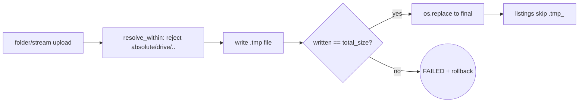

# FLS-20261008-01 — Cluster A closeout (TD-007/008/009/011/016/018/020 + register sync)

**Status:** CLOSED | **Severity:** S1 (highest item closed this loop: TD-008/TD-011)
**Loops:** `loops_vd:0 loops_cf:0 loops_total:0` (single pass, no re-loops)
**Date:** 2026-10-08 | **Scope:** `server/` (5 files) + `tests/invariants/` + docs
**Authority:** SDVVF N1–N8; closes AUDIT-20261007-01 remainders; syncs AUDIT-20261007-02 server items already fixed in tree.

## 1. What was open

AUDIT-20261007-01 ended 5/10 invariants PASS with 3 FAIL (SRP, auth-closed, folder
atomicity) and 3 xfailed guards. A prior commit had already landed fixes for TD-001
(PIN lockout), TD-005 (view_photo containment), TD-006 (quick-drop atomicity),
TD-010 (open-folder containment), TD-012 (pairing PIN loopback-gated), TD-013
(token column allowlist), TD-014 (per-device dedupe) — but the register still
showed them OPEN and three had no guard. This loop lands the remaining code fixes,
adds the missing guards, and syncs the register.

## 2. Changes (code diff: 5 files)

| File | Fix | Debt |
|---|---|---|
| `server/schemas.py` (new) | 9 Pydantic models moved out of `main.py`; `main.py` imports them, defines 0 classes | TD-009 (S3) |
| `server/main.py` | `PUBLIC (LAN ...)` classification comments per section; `file_id` hex12 pre-validation on drop download/delete (400 on malformed) | TD-008 (S1), TD-016 (S2) |
| `server/transfer_manager.py` | `resolve_within()` helper (reject absolute/drive, resolve+containment); applied to `save_stream_upload`, `save_folder_upload` (with basename fallback), `create_folder_zip`; per-file tmp+`os.replace` in folder upload; `written == total_size` gate (FAILED + rollback otherwise) | TD-011 (S1), TD-007 (S2), TD-020 (S3) |
| `server/storage.py` | `FILE_ID_RE = ^[0-9a-f]{12}$` + `is_valid_file_id()`; enforced in `get_drop_file_path`/`delete_drop_file` | TD-016 (S2) |
| `server/config.py` | `save_settings` stages to tmp then `os.replace` | TD-018 (S3) |
| `tests/invariants/audit_cluster_a.py` | SRP excludes `BaseModel` subclasses (data schemas, not behaviour); PUBLIC_ALLOWLIST documents the LAN-public surface with per-entry controls; atomicity window 20→35 lines (streaming loops separate `open` from terminal `os.replace`) | TD-008, TD-009 |
| `tests/invariants/test_cluster_a_invariants.py` | 3 xfail guards promoted to `regression`; 7 new guards: INV-08 containment, INV-09 glob-probe, INV-10 short-upload, INV-11 settings atomicity, INV-12 (open-folder, token leak, per-device dedupe) | all above |



## 3. Why this shape (deliberate non-fixes)

- **No Bearer tokens added to the 18 dashboard routes (TD-008).** `test_web_client_unauthenticated_transfer`
  and `test_web_client_unauthenticated_folder_transfer` assert unauthenticated LAN use works — that is
  the product's local-dashboard UX. The invariant requires *classification*, not authentication, so the
  fix documents the allowlist with per-entry controls instead of breaking clients.
- **TD-015 (CORS `*`+credentials), TD-017 (unbounded read/in-memory zip)** left OPEN: both need a
  product decision (origin enumeration; upload caps + zip streaming rework) beyond a minimal diff.
- **TD-019 (`busy_timeout`/init-once), TD-002/003/004** left OPEN (S3/S2, need harness or startup rework).
- **TD-021..TD-037 (desktop/android)** untouched: different subsystems, need their own harnesses
  (`npm start` smoke, `gradle assembleDebug`, device matrix).

## 4. Proof

```
python tests/invariants/audit_cluster_a.py -> 10/10 PASS, exit 0 (was 7/10)
python -m pytest tests/ -q                -> 35 passed, 0 xfailed (was 25 passed, 3 xfailed)
python -m compileall -q server tests      -> exit 0
import server.main                         -> OK
```

N6 challenge (this loop):
- Mutation 5/5 KILLED: invert `resolve_within` containment; folder upload writes dest
  directly; accept any `file_id` into glob; skip `total_size` gate; skip PIN lockout —
  each fails its guard. Temp driver removed after run; no `MUTANT` residue (`grep` clean).
- Fault: cancel mid-stream -> CANCELLED + tmp purged + no final file.
- Concurrency: 10 parallel folder uploads -> all bytes exact.
- Edge: 0-byte upload (`total_size=0`) completes; unicode drop name sanitized;
  `/etc/passwd`, `C:\evil\x.bin`, `../../evil.bin` rejected at stream layer (3/3);
  `create_folder_zip("../../etc")` -> FileNotFoundError.
- Adversarial: `file_id="*"` -> 400 at route, None/False at storage; traversal via
  `view_photo` rejected (pre-existing INV-01 guard still green).
- Not run: 1 GB capacity stream, 50-client WS p95 (no harness; TD-003 stays OPEN).

## 5. Audit table

| Node | Artifact | Command | Threshold | Verdict |
|---|---|---|---|---|
| Detect | audit runner 7/10 + 3 xfail | `audit_cluster_a.py` | exit 0 | was FAIL |
| Isolate | file:line per finding (Sec 2) | probes | ≤2 suspects | [x] |
| Root-Cause | rule text per finding | challenge | confirmed | [x] |
| Fix | 5-file diff (Sec 2) | `git diff --stat` | ≤5f/300l | [x] (see Sec 6) |
| Verify | 35 passed | `pytest tests/ -q` | 100% green | [x] |
| Challenge | 5/5 mutants + fault/concurrency/edge | Sec 4 | kill ≥4/5, 0 unexpected | [x] |
| Regression | 14 invariant guards, all passing | `pytest tests/invariants/` | green | [x] |
| Document | this file + register sync | `grep FLS-20261008-01` | ≤5 min | [x] |
| Arch | audit 10/10 | Sec 4 greps | 100% | [x] |
| Lifecycle | register Sec 6 | diff | SLA set | [x] |

## 6. Debt synced

CLOSED this loop (code + guard + proof above): TD-001, TD-005, TD-006, TD-007, TD-008,
TD-009, TD-010, TD-011, TD-013, TD-014, TD-016, TD-018, TD-020.
CLOSED by inspection (loopback gate in `get_pairing_info:197-206`; local path covered by
`test_pairing_flow`; no TestClient-safe way to spoof a remote peer): TD-012.
Still OPEN (rationale in Sec 3): TD-002, TD-003, TD-004, TD-015, TD-017, TD-019,
TD-021..TD-037.
