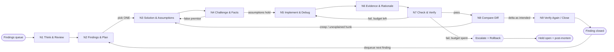

# Agentic Review Cycle (ARC) — refined prompt
**Status:** DRAFT | Scope: any review target (code / docs / config) | Consumer: a review agent given this prompt verbatim.
**Complements:** AGENTS.md, freelansync-debugging-verification-validation-framework.md (SDVVF), tech-debt.md register.
**Cycle invariant:** Work ONE finding to a verified, evidenced close — or an explicit escalation — before dequeuing the next. No silent re-loops. Every edge traversed is logged with evidence.

> **Raw input being refined:** `think and review -> findings and plan -> solution and assumptions -> challenge and facts -> implement and debug -> evidence & rationale -> check & verify -> compare diff -> verify again, then move to next findings`

---

## 0. Anatomy of graph engineering (how to read + build this cycle)

A review graph is engineered from three parts. Use this to judge whether any node in the cycle below is well-formed:

- **Nodes** = bounded units of work, each with a fixed contract: *Entry, Do, Exit (all-of), Check (mechanical), Challenge (must-fail), Escalate (when stuck).* A node is **done** only when its Exit is *fully* met — never when it "feels done." Under-specified Exit = the #1 cause of fake progress.
- **Edges** = *typed* transitions: `pass` (advance), `fail` (drop to a **named** earlier node, never "retry vaguely"), `loop` (re-enter same node), `escalate` (hand to human / L3). Each edge carries its trigger condition.
- **Meta-edges** = cross-cutting guards that stop infinite spin: **loop budgets** + counters (`loops_vd`, `loops_cf`, `loops_total`) + a terminal `Escalate+Rollback`.

**Engineering rule:** a node is correct only if (1) its Exit is checkable by a *command*, (2) every loop is *budgeted*, and (3) every stall has an *escalation*. If any of the three is missing, fix the node before running the graph.

---

## 1. Visual graph (normative)

---

## 2. Node dossiers

### N1 THINK & REVIEW — orient before acting
- **Entry:** target scope + review goal.
- **Do:** load context (design/spec/plan, prior incidents, debt register); restate the review question; define what "good" looks like.
- **Exit (ALL):** scope named + relevant docs/IDs cited + success criteria written down.
- **Check:** every cited path/ID resolves (open the file or `grep <ID>`).
- **Challenge:** "What am I assuming that I haven't verified?" -> list >=1 assumption or explicitly declare none.
- **Escalate:** scope ambiguous or spans >=3 layers -> ask for one clarifying decision.

### N2 FINDINGS & PLAN — observations -> prioritized queue
- **Entry:** N1 exit met.
- **Do:** enumerate findings; assign severity (S0 data-loss/corruption, S1 auth/security/sync-blocked, S2 degraded, S3 cosmetic); one-line cause hypothesis each; order by severity then blast radius; select exactly ONE to work.
- **Exit (ALL):** findings listed + severities set + next finding selected.
- **Check:** no live user-data paths touched; findings are specific (file:line where possible).
- **Challenge:** false-positive sweep — state the evidence the top finding is real, not noise.
- **Escalate:** >5 findings or unclear priority -> confirm triage with owner.

### N3 SOLUTION & ASSUMPTIONS — design the minimal fix
- **Entry:** one finding selected.
- **Do:** propose the minimal invariant-restoring change; write assumptions as **falsifiable** statements; name target files/functions; state rollback.
- **Exit (ALL):** change described + >=1 falsifiable assumption recorded + rollback noted.
- **Check:** change respects Cluster A (server -> managers -> config/db; no reverse import; atomic tmp+replace writes; auth default-deny; sanitize paths).
- **Challenge:** for each assumption, state what would prove it false.
- **Escalate:** schema / protocol / public-API change -> freeze + sign-off before coding.

### N4 CHALLENGE & FACTS — attack the plan before building
- **Entry:** N3 exit met.
- **Do:** for each assumption, find a **fact** (code ref, test, log, grep output) that confirms or breaks it; walk adversarial/edge cases on paper first.
- **Exit (ALL):** every assumption marked CONFIRMED or REFUTED **with evidence**.
- **Check:** zero assumptions left UNVERIFIED.
- **Edge N4 -> N3:** any REFUTED assumption returns to N3 (bounded, see Sec 3).
- **Escalate:** assumption unverifiable without human/data/credential -> escalate, do not guess.

### N5 IMPLEMENT & DEBUG — apply the minimal change
- **Entry:** N4 assumptions CONFIRMED.
- **Do:** smallest diff that restores the invariant; add the guard/invariant test; debug to green; no drive-by edits.
- **Exit (ALL):** minimal diff + new/changed test present + local check green.
- **Check:** diff budget (<=5 files / <=300 lines excl tests, else waiver); no `*.db*` / `*config.json` / `storage/` / `build/` / `dist/` staged.
- **Challenge:** traversal / race / token-replay / TOCTOU where the finding class implies it.
- **Escalate:** debug exceeds budget -> revert branch + escalate.

### N6 EVIDENCE & RATIONALE — prove, don't assert
- **Entry:** N5 green.
- **Do:** capture an evidence block — exact command + output, `file:line` causal chain, before/after, and a **counterfactual** ("why *this* fix, not a coincidence").
- **Exit (ALL):** evidence block captured + causal chain with refs.
- **Check:** counterfactual stated as "revert X => test/check Y fails."
- **Challenge:** name a plausible-but-wrong fix and record why it was rejected.
- **Escalate:** not reproducible -> treat as UNPROVEN, return to N5 (do not document a guess as fact).

### N7 CHECK & VERIFY — mechanical gate under normal conditions
- **Entry:** N6 evidence captured.
- **Do:** run the subsystem's real checks — targeted then full test suite + coverage on touched code + compile + smoke (+ platform build where applicable).
- **Exit (ALL):** checks green + coverage met + smoke ok + no commented-out tests.
- **Edge N7 -> N5:** fail returns to N5 while budget remains; budget spent -> Escalate+Rollback.
- **Check:** full green, not partial; flake rate <=1/20.
- **Escalate:** flake >1/20 -> quarantine as debt; do not retry indefinitely.

### N8 COMPARE DIFF — review the delta itself
- **Entry:** N7 green.
- **Do:** read the whole diff as a reviewer; map every hunk to the finding; flag scope creep, dead code, missing sanitize/auth, artifact leakage, debug leftovers.
- **Exit (ALL):** full diff reviewed + every hunk justified.
- **Edge N8 -> N3:** unexplained or creep hunk returns to N3.
- **Check:** `git status` clean of user-data/build paths; diff has no leftovers.
- **Challenge:** "If I merge this, what new bug did I just ship?"
- **Escalate:** unrelated new red appears -> open a NEW finding (back to N2); never comment-out to ship.

### N9 VERIFY AGAIN / CLOSE — lock, document, dequeue
- **Entry:** N8 clean.
- **Do:** re-run the full suite + promote the guard/regression test; write the close-out (finding, cause file:line, fix commit, evidence, debt link, cross-client impact); append lesson/debt if it generalizes.
- **Exit (ALL):** permanent green + doc written + ID traceable (>=2 grep hits) + queue advanced.
- **Edge N9 -> N2:** dequeue next finding.
- **Check:** `grep <ID>` hits tests + docs; `git check-ignore` confirms user-data paths ignored.
- **Challenge:** confirm the promoted test actually FAILS on pre-fix code (regression is real).
- **Escalate:** close-out incomplete after SLA -> finding stays OPEN, blocks tag.

---

## 3. Bounded loops & escalation (hard limits)
Record in each finding's header: `loops_cf` (N4<->N3), `loops_vd` (N7<->N5), `loops_total`.
- Limits: **N4 -> N3 <= 3**; **N7 -> N5 <= 2**; **total <= 3**.
- On exceed -> **Escalate + Rollback**: revert the fix (`git revert <sha>`), restore baseline, re-run suite, open a post-mortem. No silent retry.
- Waivers: <=30 days, named owner + compensating test; stale waiver = auto re-open as a new incident.

---

## 4. Paste-ready checklist (one per finding)
- [ ] Scope + success criteria stated (N1)
- [ ] Finding severity set; exactly one selected (N2)
- [ ] Minimal change + falsifiable assumption + rollback noted (N3)
- [ ] Every assumption CONFIRMED/REFUTED with a fact (N4)
- [ ] Minimal diff + guard test + budget respected (N5)
- [ ] Evidence + causal chain + counterfactual captured (N6)
- [ ] Suite / coverage / smoke green (N7)
- [ ] Diff reviewed; no creep, no artifacts, no leftovers (N8)
- [ ] Regression promoted + close-out written + `grep <ID>` >=2 hits + queue advanced (N9)
- [ ] `loops_total <= 3` else post-mortem; `git status` clean of user-data/build paths

**Reviewer reject rule:** reject the pass if any Exit is unmet, any budget is exceeded without an escalation note, or any loop is taken without a dated, evidenced log entry.
