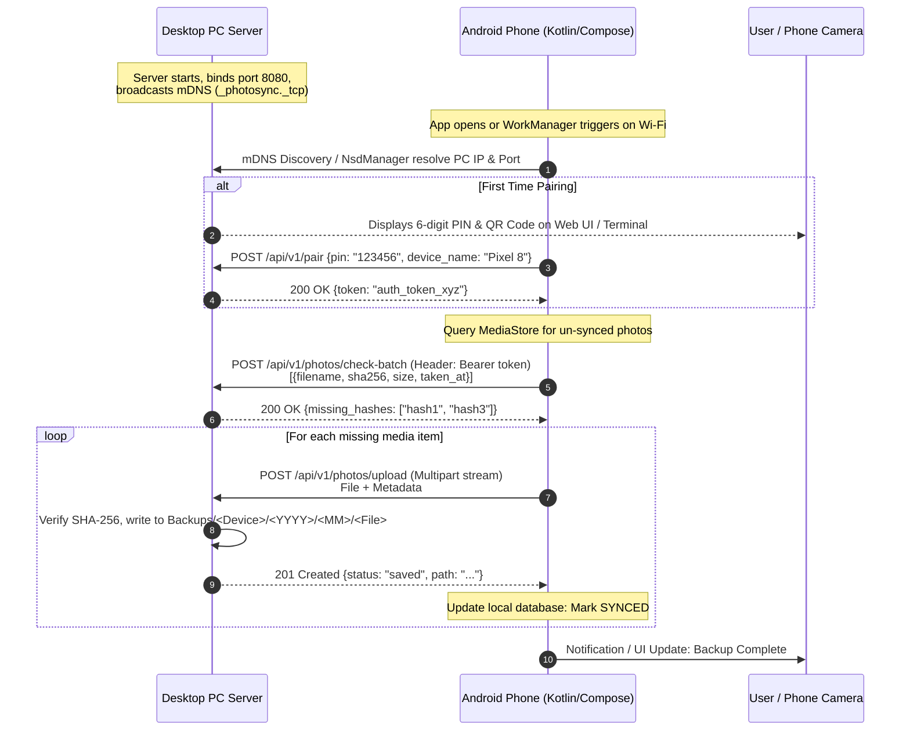

# Architectural Specification: Local Wi-Fi Photo Sync & Backup System

**Date**: 2026-10-07  
**Status**: APPROVED & IMPLEMENTING  
**Author**: Antigravity Autonomous Pair Programmer

---

## 1. Executive Summary

This project delivers a high-speed, private, local Wi-Fi photo & video backup system connecting Android smartphones directly to a Windows Desktop Server file system without third-party cloud intermediaries.

The system comprises two core components:
1. **Desktop Server (`server/`)**:
   - Python 3.14 + FastAPI + Uvicorn + Zeroconf (mDNS) + SQLite metadata store.
   - Built-in responsive web dashboard (HTML5/Tailwind/Lucide) accessible on desktop and mobile browsers.
   - mDNS local network service advertisement (`_photosync._tcp.local.`).
   - One-time QR Code & 6-digit PIN pairing mechanism.
   - Streaming multipart file upload endpoint with SHA-256 pre-flight hash verification and atomic file writes.
   - File system hierarchy: `Backups/<DeviceName>/<YYYY>/<MM>/<filename>`.
   - Permanent archive retention (no deletion on server when deleted from phone).
   - Windows Service / portable launcher scripts (`run_server.bat` and system tray daemon capability).

2. **Android Client (`android/`)**:
   - Native Android application built with Kotlin, Jetpack Compose, Material Design 3.
   - Background synchronization managed by **Android Jetpack WorkManager** (`PeriodicWorkRequest` & `OneTimeWorkRequest`).
   - Constraints: Requires unmetered Wi-Fi network (`NetworkType.UNMETERED`) and optional charging constraint.
   - Local network discovery via Android `NsdManager` (Network Service Discovery) resolving `_photosync._tcp`.
   - Local database (Room / SQLite) tracking synced media ID, SHA-256 hash, and sync timestamps.
   - MediaStore API integration querying Photos (`image/*`) and Videos (`video/*`).
   - Clean, modern UI with real-time status indicators, device pairing via QR/PIN, backup progress bar, and "Sync Now" trigger.

---

## 2. System Architecture & Network Flow



---

## 3. Server Specifications

### 3.1 API Endpoints
- `GET /api/v1/ping`: Health check and server name discovery.
- `GET /api/v1/pairing/info`: Current pairing state, PIN status, and QR code payload.
- `POST /api/v1/pairing/verify`: Exchange 6-digit PIN for device authorization token.
- `POST /api/v1/photos/check-batch`: Fast deduplication lookup. Accepts array of `{sha256, size, filename}`, returns array of missing hashes.
- `POST /api/v1/photos/upload`: Multipart stream endpoint. Form fields: `device_name`, `taken_at`, `relative_path`, file data.
- `GET /api/v1/devices`: List of paired devices and their backup statistics.
- `GET /api/v1/photos/recent`: List recent backups for display in web UI.
- `GET /`: Responsive Web UI (Single Page App) for server management, QR code display, storage stats, and gallery preview.

### 3.2 File System Architecture
```
storage/
└── Backups/
    └── <DeviceName>/
        └── 2026/
            └── 10/
                ├── IMG_20261007_120000.jpg
                └── VID_20261007_120500.mp4
```

---

## 4. Android Client Specifications

- **Package**: `com.photosync.app`
- **Min SDK**: 26 (Android 8.0)
- **Target SDK**: 34 / 35 (Android 14 / 15)
- **Permissions**:
  - `INTERNET`, `ACCESS_NETWORK_STATE`, `ACCESS_WIFI_STATE`
  - `READ_MEDIA_IMAGES`, `READ_MEDIA_VIDEO` (Android 13+)
  - `READ_EXTERNAL_STORAGE` (Legacy fallback)
  - `POST_NOTIFICATIONS` (Android 13+ background progress)
  - `FOREGROUND_SERVICE`, `FOREGROUND_SERVICE_DATA_SYNC`
- **Components**:
  - `MainActivity`: Jetpack Compose single-activity architecture.
  - `NsdDiscoveryManager`: Handles Network Service Discovery.
  - `PhotoSyncWorker`: Jetpack `CoroutineWorker` handling background batch checks and uploads.
  - `SyncRepository`: Coordinates MediaStore queries and API interactions.
  - `AppDatabase`: SQLite / Room DB for local sync history.

---

## 5. Verification & Testing Strategy

1. **Unit & Integration Tests**:
   - Backend endpoint tests with `pytest` / `httpx`.
   - SHA-256 deduplication and collision safety tests.
   - Network failure and resumption tests.
2. **Android Build Verification**:
   - Gradle build validation (`assembleDebug`, `assembleRelease`).
   - Production APK packaging.
3. **End-to-End Simulation**:
   - Automated end-to-end sync simulation uploading mock images/videos through the client engine.
   - Double-check second verification loop before completion.
